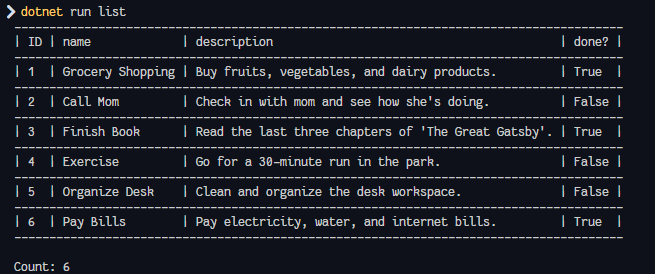

# CsharpTaskManagement - CLI Task Management Application

[](https://dotnet.microsoft.com/en-us/download/dotnet/8.0)
[](https://dotnet.microsoft.com/en-us/languages/csharp)

A command-line interface (CLI) application for managing tasks developed in C#.



## Features

- **Add tasks:** Create new tasks by providing a name and description.
- **List tasks:** Display all saved tasks in a tabular format.
- **Get task:** Retrieve and display the details of a specific task by its ID.
- **Mark task as done:** Update a task’s status to "done".
- **Delete tasks:** Remove specific tasks using their ID.

## Installation and Execution

### Requirements

- [.NET SDK 8.0](https://dotnet.microsoft.com/en-us/download/dotnet/8.0)
- Optional: Text editor or IDE such as Visual Studio, Visual Studio Code, or JetBrains Rider.

### Configuration

1. Optionally, you can change the path of the JSON file where tasks are saved:
   ```cs
   var services = new ServiceCollection()
   .AddTransient<ITaskRepository>(provider => new JsonFileTaskRepository("custom_path.json"))
   .BuildServiceProvider();

   ITaskRepository taskRepository = services.GetService<ITaskRepository>()!;
   ```
2. Build the project:
   ```bash
   dotnet build
   ```
3. Run the application:
   ```bash
   dotnet run -- <command> [options]
   ```

## Usage

### Add a new task

```bash
dotnet run -- add -n "Task Name" -d "Task Description"
```

### List all tasks

```bash
dotnet run -- list
```

### Get a task by ID

```bash
dotnet run -- get -i <task_id>
```

### Mark a task as completed

```bash
dotnet run -- mark-done -i <task_id>
```

### Delete a task by ID

```bash
dotnet run -- delete -i <task_id>
```

## Acknowledgments

- **[CommandLineParser](https://github.com/commandlineparser/commandline):** For handling command-line arguments and options.
- **[ConsoleTables](https://github.com/khalidabuhakmeh/ConsoleTables):** For creating tables to list tasks.
